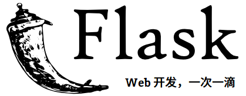

.. rst-class:: hide-header

Welcome to Flask
================

欢迎来到 Flask 的文档。你可以从 :doc:`installation` 入手，然后阅读
:doc:`quickstart` 来了解基本概念。还有一个包含更多细节的 :doc:`tutorial/index`
介绍如何用 Flask 创建一个很小但是完整的程序。一般的开发模式可以在
:doc:`patterns/index` 章节找到。剩下的文档详细的介绍了 Flask 的每一个组成部件，
其中 :doc:`api` 章节包括完整的 API 参考信息。

Flask 依赖 `Jinja`_ 模板引擎和 `Werkzeug`_ WSGI 工具集。这些库的文档如下：

- `Jinja 文档 <https://jinja.palletsprojects.com/>`_
- `Werkzeug 文档 <https://werkzeug.palletsprojects.com/>`_

.. _Jinja: https://www.palletsprojects.com/p/jinja/
.. _Werkzeug: https://www.palletsprojects.com/p/werkzeug/

用户指南
--------

这部分的文档大部分是独立章节，以一些关于 Flask 的背景信息开始，然后重点介绍如何使用
Flask 一步步进行 Web 开发。

.. toctree::
   :maxdepth: 2

   foreword
   advanced_foreword
   installation
   quickstart
   tutorial/index
   templating
   testing
   errorhandling
   debugging
   logging
   config
   signals
   views
   appcontext
   reqcontext
   blueprints
   extensions
   cli
   server
   shell
   patterns/index
   deploying/index
   becomingbig
   async-await

API 参考
--------

如果你想找关于某个特定函数、类或方法的信息，那么这部分文档是就为你准备的。

.. toctree::
   :maxdepth: 2

   api

附加笔记
--------

如果你感兴趣的话，这里有一些设计笔记、法律信息和变更日志（changelog）。

.. toctree::
   :maxdepth: 2

   design
   htmlfaq
   security
   extensiondev
   contributing
   license
   changes
