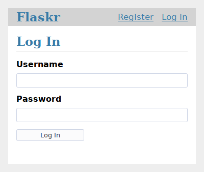

教程
====

.. toctree::
    :caption: 目录:
    :maxdepth: 1

    layout
    factory
    database
    views
    templates
    static
    blog
    install
    tests
    deploy
    next

这个教程会一步步带你创建一个基础的博客程序，它叫做 Flaskr。在这个程序里，用户将可以
注册、登录、创建文章、编辑或删除文章。你还将会学习打包程序，这样就可以在其他电脑上
安装这个程序。

.. image:: flaskr_index.png
    :align: center
    :class: screenshot
    :alt: 首页截图

这个教程假设你已经熟悉了 Python。Python 文档里的 `官方教程`_ 是一个学习和复习
Python 很好的方式。

.. _官方教程: https://docs.python.org/3/tutorial/

虽然这个教程的设计初衷是为了提供一个良好的起点，但它并没有覆盖所有的 Flask
特性。你可以阅读 :doc:`/quickstart` 对 Flask 可以做什么建立一个全局认识，
然后深入其他文档了解更多内容。这个教程只使用了 Flask 和 Python 提供的功能。
在你开发的另一个项目里，你也许会想要使用 :doc:`/extensions` 或其他库让某些功能
实现起来更简单。

Flask 很灵活。它不需要你使用任何特定的项目或代码结构。然而，在刚起步的时候，
使用更结构化的代码组织方式会更好一些。这意味着这个教程将会在一开始花费一些
时间来创建项目结构和基础代码，不过这样做可以避免很多新手开发者容易遇到的
常见错误，而且这样会创建一个容易扩展的项目。一旦你更熟悉 Flask，你就可以
跳出这个结构并充分利用 Flask 的灵活性。

.. image:: flaskr_edit.png
    :align: center
    :class: screenshot
    :alt: 编辑页面截图

如果你想要把你的项目和跟随这个教程实现的最终产品进行比较，这个教程项目的源码
可以在 :gh:`Flask 仓库的 examples 文件夹 <examples/tutorial>` 找到。

下一节是 :doc:`layout`。
